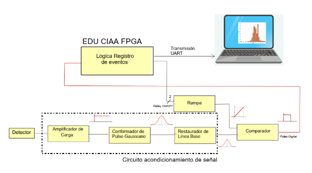
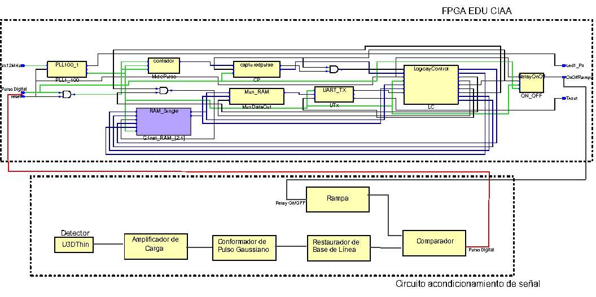
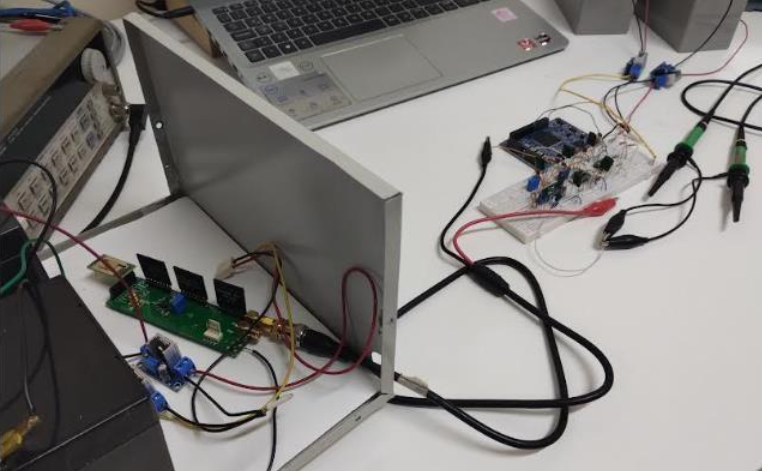
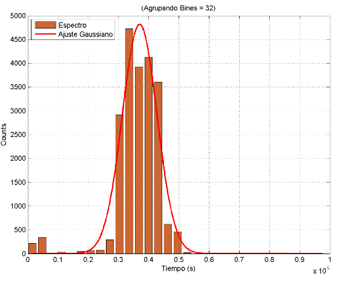

# FPGA-Based Readout Electronics for Semiconductor Radiation Detectors

This repository contains my final Electronic Engineering project developed at the **National University of Mar del Plata (Argentina)**.

The objective of this project was to design a complete electronic readout system capable of conditioning, digitizing and processing signals generated by semiconductor radiation detectors.

The system combines **analog front-end electronics**, **FPGA-based digital processing**, and a **MATLAB interface** for data acquisition and visualization.

---

# System Overview

The detector generates very small current pulses whose amplitude is proportional to the deposited energy.

The analog front-end conditions these signals before they are processed by the FPGA.

The FPGA measures the pulse width using the **Over Threshold** technique, generates a digital histogram and transmits the acquired data to a computer through UART.



---

# Digital Architecture

The digital system was implemented in VHDL and includes several hardware modules working in parallel.

Main digital blocks:

- Finite State Machines (FSM)
- Counter
- Register
- RAM Controller
- UART Communication
- Histogram Generation



---

# Analog Front-End

The analog electronics were designed to convert the detector current pulses into digital information suitable for FPGA processing.

The analog chain includes:

- Charge Amplifier
- Gaussian Pulse Shaper
- Baseline Restorer
- Over Threshold Circuit

---

# Prototype

The complete prototype combines the analog electronics with the FPGA development board.



---

# Experimental Results

The implemented system successfully measured radiation events and generated digital histograms that represent the deposited energy.



---

# Repository Structure

```text
images/
rtl/
analog/
matlab/
docs/
report/
```

---

# Development Tools

- VHDL
- Intel Quartus
- MATLAB
- LTspice

---

# Repository Status

🚧 This repository is currently being organized and documented.

Future updates will include:

- RTL source code
- LTspice simulations
- MATLAB scripts
- Engineering documentation
- Design decisions
